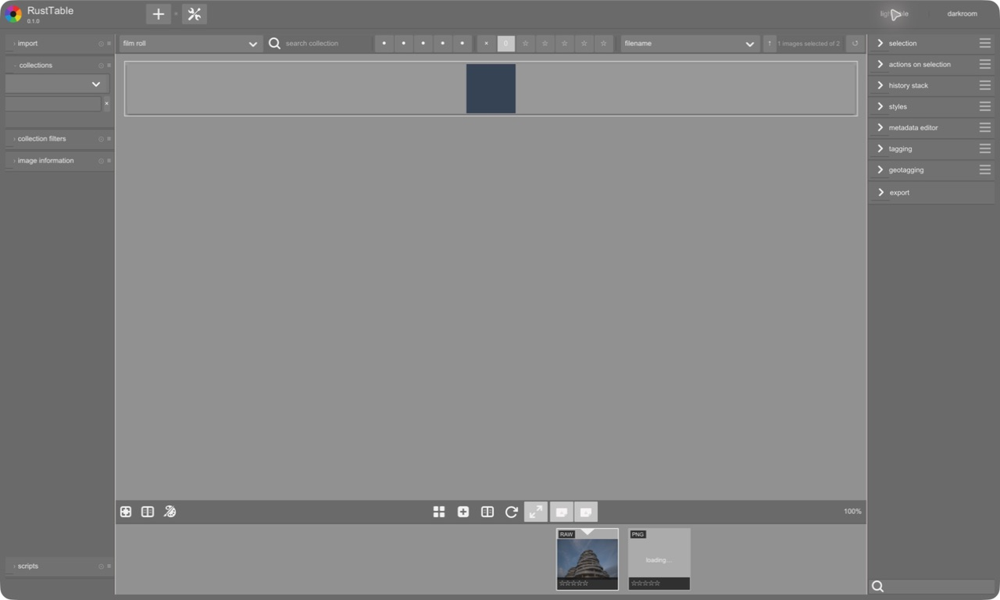
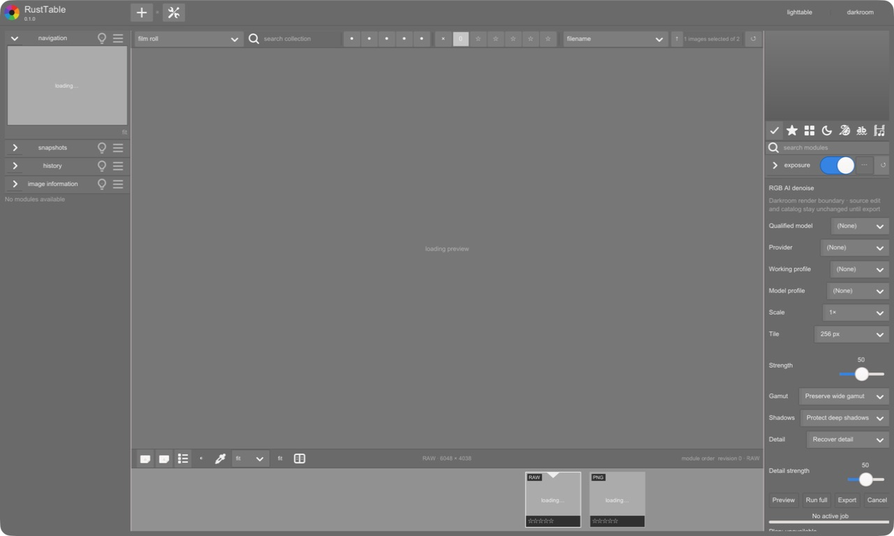

# RustTable

RustTable is a complete rewrite of [darktable](https://github.com/darktable-org/darktable) in Rust, using GTK4 through [gtk-rs](https://github.com/gtk-rs/gtk4-rs) for the desktop UI. The pinned native tree is retained at its original paths as a non-built, read-only porting oracle; a separate checkout remains available for runnable behavioral and visual comparison.

The migration proceeds file by file in dependency order. Each Darktable responsibility maps to an obvious nested path in the existing Rust workspace, with source-derived tests and production routing completed before its retained native file can be deleted. Cargo never compiles, links, or ships the retained C/C++/OpenCL implementation. Historical generated contracts keep their own source-provenance hashes until the corresponding responsibility is faithfully migrated.

## Setup

Install the toolchain selected by `rust-toolchain.toml`. Bun is needed only for the macOS app installer and distribution tooling.

```sh
git clone https://github.com/cgasgarth/RustTable.git
cd RustTable
cargo install cargo-deny --version 0.19.8 --locked
git config core.hooksPath .githooks
```

Migration development uses one checkout and the long-lived `codex/file-by-file-migration` branch. Create or switch to that branch before implementation, then run `bash scripts/dev/doctor.sh`. Do not create Git worktrees for this repository.

## Build and run

```sh
cargo build --package rusttable-app --bin rusttable-app --locked
cargo run --package rusttable-app --bin rusttable-app --locked
```

On macOS, install or replace the canonical Computer Use app:

```sh
bun run install:computer-use
```

Installation does not open or activate RustTable. Add `-- --launch` for a deliberate foreground
launch; it uses a normal decorated window sized to the current screen's usable working area,
preserving the menu bar, title bar, traffic lights, and Dock rather than entering native macOS
full-screen.

Deliberate side-by-side screenshot review is also foreground-only and requires acknowledgement:

```sh
bun run screenshot:ui-review -- --allow-foreground
```

The macOS lifecycle command validates the installed bundle without launching it by default.
Foreground launch and real Command-Q validation are deliberately separate:

```sh
bun run smoke:macos-computer-use
bun run smoke:macos-computer-use -- --allow-foreground
```

## Current interface

| Lighttable | Darkroom |
| --- | --- |
|  |  |

## Product engineering tasks

```sh
cargo xtask check
cargo xtask codegen operations --check
cargo xtask fixtures verify
cargo xtask reference provision --help
cargo xtask reference test --help
cargo xtask bench run --check
cargo xtask bench compare --help
cargo xtask dist
```

`cargo xtask check` is the complete local commit gate. It runs formatting, strict all-target/all-feature Clippy and tests, rustdoc, numerical and generated-operation validation, export and fixture checks, and standard dependency checks. Its GTK runtime smokes use non-activating test windows and do not launch the foreground screenshot workflow. Post-merge validation may add platform, coverage, packaging, and distribution checks.

## Contribution model

Port the next dependency-ready Darktable file completely in the single checkout and commit coherent mappings on `codex/file-by-file-migration`. Open a ready-for-review PR against `main` only at a meaningful migration milestone, then squash merge it after local validation. See [CONTRIBUTING.md](CONTRIBUTING.md), [TASK.md](TASK.md), and [AGENTS.md](AGENTS.md).
